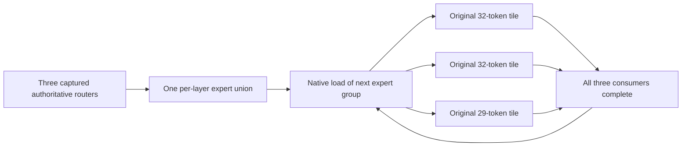

# C248 — selected native expert reuse numeric freeze

Prospective B2 operator unit, NOT_RUN. Schedule is conditional on the owner-defined A1 discriminant/pivot; preparing this protocol does not admit concurrent or premature physics. Six new native CPU processes: layer0 A/B, layer12 A/B, layer24 A/B. No full Transformer and no CUDA experimental operator.

SOURCE_AUDITED original C75 per-layer pool40, wave capacity18, original four worker/direct loader. Control A uses separate wave plans for three original captured numerical tiles32/32/29 at positions0/128/160. Candidate B makes one authoritative93-position expert union and holds each resident group until all three original MMID tile consumers finish. Every next-wave ordering dependency includes all prior tile consumers, with a model-free graph counterproof. Existing next-wave prefetch is reused, not claimed as new.

Exact original MXFP4 slices/biases, SWIGLU_OAI1.702/7, masked per-pair accumulation followed by original routing weights and topk0..3 sum. At each numeric consumer, verify six canonical components via C211 bounded O_DIRECT reader, logical expert, physical slot, positive generation, resident/keep/worker completion. No buffered fallback. Witness expects A171/114/134 versus B79/64/68 unique active combinations; each comparison has all six components. Selected complete FFN outputs must equal C127 independent canonical/native outputs bitwise and be finite. C237 reconstructed-C75 bitwise bridge and actual pinned capture component hashes support reference reuse; the36 old references are not rerun or expanded by association.

Native slot generation sum must equal demand plus preload reservations after bounded worker drain. Preloads are real loads. From the empty pool, B must serve exactly the captured union79/64/68 loads; control's actual reloads are measured, not inferred as the sum of tile unions. Missing outputs, wrong profile/types, NaN, absent byte checks, stale/duplicate generations, buffered reader, incomplete workers or a loop reorder that still reloads are model-free counterproofs. Four directed tests PASS; this is not numerical or performance qualification.

ESTIMATED admission:528,768,000B original weight pool,4,423,680B biases,96MiB metadata/contexts, conservative512MiB graph/workspace,16MiB reader scratch, plus1GiB uncertainty =2,261,244,928B. Common4GiB cap/high, preventive3.5GiB, swap0. Live inventory/host pressure/GPU/CPU/NVMe/power guards remain authoritative. Each process has own60s inventory/freshness,90s operator deadline,30s postgate;1260s full serial envelope and96MiB raw projection. No increase after failure under this identity.

Numeric witness work is never used as production timing. End-to-end later operator timing will include native loads/preloads, compute, masked accumulation, ordered reduce and coordination, while reporting metadata/bias/graph allocation separately. Equal memory and actual eliminated reloads are required; a local success does not prove complete153 prefill, first-final, attention/KV or utility. Only a surviving operator can justify capturing the missing contiguous workload or integrating the existing layer boundary.

A prospective compact-path lookup initially named absent C237/analysis.json; the preparation failure is preserved and resolved to actual numeric-bridge.json before freeze or model Popen. Original failures and primary raw unchanged. LOCAL_ONLY.
