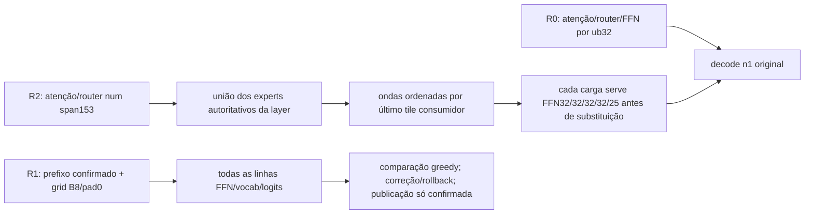

# C274 — fecho da questão arquitetural pós-C235

## Decisão e autoridade

**ARCHITECTURAL_DISCRIMINANTS_RESOLVED_SCOPED_GAIN_UTILITY_GAPS_REMAIN.**

Esta época produziu verificador completo, integração real do head pinado, operador de reutilização e integração nativa limitada do executor. As decisões assentam em física e referências selecionadas. Não entrega um novo perfil operacional nem demonstra M4.

|ramo|resultado efetivo|próximo estado|
|---|---|---|
|A: B8/EAGLE3 fixed-grid|A1 perfect-assist promissor; implementação real com head mais lenta em duas classes|`NO_GO_CURRENT_HEAD_GRID_DEVELOPMENT_SCREEN`, âmbito curto C258; nenhuma promoção|
|B: expert-major/153/último uso|elimina recargas no operador; custo integrado GO; código livre +8,91% first-final; planeamento B2/2 correto contra A0/2 cap|ganho limitado e vantagem funcional preservados; `NO_GO_TWO_CLASS_NATIVE_UTILITY_SCREEN`, latência de planeamento inconclusiva|
|4K/holdouts/confirmatory/Q|não admitidos pelos gates dos sobreviventes|`NOT_RUN_DEVELOPMENT_GATE` A / `NOT_RUN_TWO_CLASS_SCREEN_GATE` B|

Não se fecha por ter compilado um helper nem por uma única resposta atingir o cap: foram concluídos os oito braços C273, os candidatos correspondentes aos controlos truncados, duas classes e o estudo independente de custo/correctness. O screen de uma classe conserva valor; não satisfaz a promoção de duas classes nem obriga a gastar a reserva numa confirmação sem o gate. Não aumentar cap nem trocar prompt para recuperar a família. Não lançar outra flag, head ou arquitetura nesta época.

Base publicada reconciliada `8c78f598e446b1b09fb3ba518b77e0d7496bfa47`; fecho C235 LOCAL_ONLY e publicação posterior continuam históricos. Branch dedicada `campaign/120b-block-verifier-expert-reuse-20261004T105527Z`, sem upstream configurado e sem publicação. Measurement C273 `9c0c25a9e6dce528c385fbec3086f4cc24ec749d`; resultado/analysis predecessor `f546b2e`. O SHA do commit final é apresentado fora dos seus próprios ficheiros para evitar hash circular. Main, branch histórica, serviço e default intactos.

## Fronteiras realmente alteradas

SOURCE_AUDITED: base streaming `1248fd8fa8cfebaece5ea992e4d951c1e18bb9d5`, C75 `27d2e42d8c994507ee6d71acc7c58d3eddd3f7a5`. C236 reconstruiu explicitamente o runtime cujo artefacto /tmp desaparecera; é uma identidade nova. Backends/builds C236, C262 e C269 separados e preservados. C269 só ordena a união já autoritativa por último uso nos tiles: não prevê router futuro, não muda quota, top-k, experts, pares, kernels FFN ou ordem de redução por token.

R2 integra a fronteira nas layers do Transformer existente, incluindo atenção/KV/router e transição para decode. No cliente CAPI só o call incremental153 ativa mode2; prewarm e decode n1 usam o percurso original. Env span153 sozinho não ativa o candidato. Não houve implementação de um novo Transformer nem integração no servidor/preset C143.

## Contrato numérico e causal

|identidade|contrato|cobertura observada e limites|
|---|---|---|
|R0|C75 autoregressivo operacional, reconstruído com flags pinadas|C237:250 estados/1500 core payloads, máscaras, cinco logits e996 checks de bytes bitwise com C127; referências antigas condicionadas à identidade relevante|
|R1|grid B8 fixo, pad0 determinístico, avaliador independente das propostas futuras|C239/C243/C244: causalidade de sufixos, mapas de linhas, rejeições, trim/replay, cancelamento/continuidade selecionados;126 queries,882 rows e nove cancel/rollback; referências novas C240|
|R2|atenção/router153, FFN em tiles nativos32, redução ordenada por token|C265:216 stages/seven logits tile/shared bitwise; C266:router/top-k/weights nativos153 e11 FFN de CPU0/CUDA25/35; C267 clean/capture neutralidade; C270 default R0 e R2 último uso bitwise dentro do próprio perfil|

R1 pode diferir de R0 por shape/arithmetic; igualdade dos greedy IDs selecionados é separada de igualdade de todos os estados. O custo de replay da grid após rejeição é incluído. R2 muda a geometria da atenção/router face a R0: é perfil próprio, sem herança geral de qualidade. C271 mantém uma diferença de argmax numa das33 posições teacher-forced; C273 código tem igualdade dos IDs gerados nos dois pares, planeamento tem trajetórias diferentes. Não há claim de igualdade universal greedy, full8K ou distribuição estocástica.

C211 O_DIRECT bounded verifica slices originais sem fallback buffered; witness valida expert/slot/generation e seis componentes antes de consumo, com máscaras/lifetime/pins pertinentes. Router/top-k/pesos/escalas/biases/quantização GPT-OSS120B originais continuam a autoridade. Capturas e referências ficam fora das janelas de timing de produção. As36 FFN históricas não foram repetidas por rotina; novos shapes tiveram referências próprias. Cobertura finita/source não recebe etiqueta FORMAL universal.

Falhas preservadas: mapping de logits C241, observação enviesada C238, head conversion C252/C253, draft KV C255, aggregate CLI C258, observers C262/C263/C264 e proteção decode C268. Reparos identificados receberam testes/novas identidades. C258 reanálise model-free não executou outra física. C272 interrompido por AC→bateria mantém FAIL e população incompleta; C273 foi uma nova família completa após o owner indicar restabelecimento e AC ser observada. Não mistura amostras nem substitui o braço falhado.

## A: custo de verificação e head completo

MEDIDO_NO_TARGET: B2/B4 não passaram a margem económica. C247 B8/K7,32 posições úteis e todas as linhas de saída, passou o perfect-assist/zero-draft com dois pares novos por classe:

|classe|ganho par1 %|ganho par2 %|mediana %|D_budget a15%,L8, mediano s|
|---|---:|---:|---:|---:|
|código|25,314603|17,984321|21,649462|0,2104|
|planeamento|18,828952|19,322811|19,075882|0,1064|
|âncora nominal153|14,677947|21,965338|18,321642|0,0819|

`T_AR=wall_AR/posições úteis`, `L_break_even=(V_B+D+R)/T_AR`, `D_budget=(1−g)*L*T_AR−V_B−R`. O cenário inicial D0/R idealizado e L8 não mede aceitação do head; para L7 o orçamento nas duas classes é negativo. Anchor é input conhecido, excluído do numerador; propostas/bonus não são contados duas vezes. Last-logit-only não foi usado como verificador completo.

Após pin/download/conversão auditada e C257 fidelity, C258 mediu o custo completo do head real:

|classe|AR/head par1 s|AR/head par2 s|mediana decode %|
|---|---|---|---:|
|código|14,740788 /17,267693|13,235810 /16,481299|−20,831391|
|planeamento|11,604039 /17,271688|10,544076 /17,964229|−59,607384|

32 tokens novos por braço; head precisa12/15 verificações B8,96/120 rows,20/17 propostas iguais, L médio2,667/2,133. Draft/features, materialização, trabalho descartado e replay não são gratuitos. Os33 IDs greedy com anchor concordam no conjunto observado. Diagnóstico sustentado: a amortização alcançada é insuficiente com a grid/replay atual; não atribuir exclusivamente a um termo sobreposto de wait/bytes. Curto prefixo135/184 e32 outputs: não extrapola a contextos2K/4K, outros heads/hardware ou toda especulação. Sem reparo barato concreto identificado, fecha o desenho atual e não abre uma grelha.

Head único NVIDIA revisão `633caf45f31288cbb70ee237f7c939db707ecc94`,430964464B, SHA1831df81533be3ce4901a382afdedc1ad7c1af3ab3f4b4708e21210c00e3b6f6. Derivado GGUF SHA4f6b2fec94d4d891a10841e7ea0d24d70524ee6ee4f1a430d922aefe7928a7ee; C254 oracle BF16/F32/permutação. Target embedding/output efetivamente partilhados, head CPU ~363,55MiB e GPU ~47,47MiB no placement medido; tamanho de ficheiro não é footprint runtime. Metadados/licença locais preservados. Nenhum download adicional ou peso publicado no fecho.

## B: cargas recuperáveis, operador e integração

SOURCE_AUDITED: pools e vítimas são por layer; outras layers não expulsam diretamente slots da layer atual. READY e INFLIGHT são distintos. Uniões offline/lower bounds lógicos não são agendas realizáveis nem bytes físicos NVMe.

INFERIDO/ESTIMADO a partir de traces preservados: C163 slots44 CAPI tem envelope otimista de wait duplicado41,23% num warm153; C261 C135 servidor slots40 trace-on observa798 loadsCPU/424GPU,119/101 recargas vistas e wait union7,901561s em11,702723s. Apagar otimisticamente intervalos de recargas vistas dá3,852234s/32,9174% do prefill, sob overhead0/I/O/compute inalterados e estado inicial incompleto. LOAD_END não é necessariamente commit. Não misturar perfil/origem/denominador nem chamar esse bound speedup.

MEDIDO_NO_TARGET C259/C260: operador CPU0/12/24, mesmos três tiles capturados32/32/29 e mesmo pool40/4workers; referência nativa/canónica bitwise. Carga+compute+scatter/redução/coordenação inclusivos:

|layerCPU|loads A/B|ganhos dois pares %|mediana %|
|---|---|---|---:|
|0|117/79|33,3292 /39,4204|36,3748|
|12|67/64|6,3538 /8,2005|7,2772|
|24|88/68|21,6953 /21,8326|21,7640|

Cada load lógico corresponde a **13219200B** pelos três componentes peso/bias desse expert. Isto não mede tráfego físico NVMe. Não é só loop reorder com cargas idênticas: a mesma carga serve múltiplos tiles antes de substituição. Estes tiles são disjuntos, não todo warm153.

C268 integração inicial: prefill+28,67%, decode−10,29%, NO_GO da proteção; preservada. Diagnóstico C269: últimos quatro tokens tinham371 ready hits no tile-major contra303 na ordem shared first-use. Ordem de último tile consumidor usa apenas o router atual; C270 mostrou373 hits e selected neutrality/fidelity. Hits não provam causalidade exclusiva nem previsão do próximo token.

C271 quatro processos novos, originalprefix2044 +153 +32 forwards teacher-forced, produção sem captures:

|arm|perfil|prefix s|prefill153 s|decode32 s|total s|
|---|---|---:|---:|---:|---:|
|1|R0|94,415621|11,867869|9,769421|21,637290|
|2|R2 último uso|93,493743|9,657380|9,778436|19,435815|
|3|R2 último uso|94,724722|10,559353|10,273250|20,832603|
|4|R0|98,773281|12,838629|10,172317|23,010947|

Ganhos prefill18,625829/17,753268%, mediana18,189548%; decode−0,092275/−0,992228%, mediana−0,542251%, proteção válida; total+9,820500%. Mesmo estado inicial completo/drain dos workers. LoadsCPU/GPU1486/638 A versus1465/608 B. Novo perfil também altera atenção/router/dispatch: não atribuir todo ganho exclusivamente às recargas eliminadas no operador. Não é geração livre nem tok/s.

## Utilidade livre C273: toda a população

Ver [C273-NATIVE-UTILITY-SCOPED-RESULT-20261004.md](C273-NATIVE-UTILITY-SCOPED-RESULT-20261004.md) e `results/c273-layer-utility-ac-restored-20261004/compact.json` para os oito braços, todos os pares/proteções, inputs, finish/counts, raw e recursos.

|classe|A1/B2 primeiro final s|A4/B3 primeiro final s|resultado|
|---|---|---|---|
|código|40,812756 /37,306696|41,219008 /37,410644|mediana+8,914968%, ambos positivos e corretos; validado+5,244724%|
|planeamento|NA /120,489242|NA /111,463776|A length768 sem final nos dois; B stop470 correto nos dois; sem rácio de latência|

Código: completion+4,778448%, prefill incremental+23,078743%, cold-first-final+2,814240%, cold-prefill+3,775839%, prefix−1,374107%, decode/native-output+0,617993%. Todas proteções passam. Planeamento: conclusões truncadas A178,153494/174,475473s, resultados validados B129,870353/120,268667s, sucesso A0/2,B2/2. A não tem latência de final; nenhuma imputação0 ou ratio entre truncamento e resposta válida. Mais reasoning não é censurado da população. Não sumarizar só survivors.

Inputs oficiais2105/2154, prefix1952/2001 e153 novos; transcript fornecido igual, novos outputs não alimentam prompts. É warm153 construído, não o nominal153 histórico nem conversa com cache reuse do servidor. Native client expõe IDs realmente amostrados; histórico outputIDs NOT_EXPOSED não foi retokenizado/reclassificado. Seconds/output inclui EOG na contagem nativa, forwards n1 separados; não é equal-FLOPs nem servidor predicted_n.

## Recursos, testes e reprodução

Host observado: HX370, RTX4060Laptop8188MiB, driver615.71.09/CUDA runtime13.4, toolkit13.3/GCC15, RAM32698781696B, NVMe/btrfs. Inventários próprios60s/freshness e guards STREAMING qualificados; swap0, high=max, cap congelado por unidade (operador4GiB; integração20GiB). Sem alterações power/clocks/fans, sem flush global, sem modelo concorrente. Estado quente operacional e cache do SO são limitações; não excluir braços válidos por temperatura.

C273 máximos Tctl95,5°C é warning, não stop100; GPU67°C/6972MiB, NVMe62,85°C; cgroup current16204521472B, peak familiar acumulado16225808384B. Zero eventos OOM/high/max e swap próprio zero. RSS, file e anon não são somados como autoridades independentes. Clocks/energia opcionais insuficientes são UNKNOWN; CPU-segundos não são joules. Todas as falhas de recursos, incluindo C272, continuam no ledger.

REPRODUZIDO_MODEL_FREE: contratos grid/anchor/bonus/rollback, counterproofs e supervisores nas respetivas etapas. No último caminho: graph metadata/lifetime real C269 PASS; cinco testes de gate fidelity C269; quatro testes de evidence/cardinalidade/outcomes/validação C272; gold e mutants dos graders C131; três testes de oracles/verificador bwrap C236. Receipts completos e hashes em `directed-test-receipts-index.json`, sem alegar suite integral/CI remota ou rerun no fecho. Nenhum gold foi entregue ao modelo.

`identity-manifest.json` fixa os três backends, source/patches, modelo por stat+SHA previamente estabelecida, libs rehashed no fecho, toolchain/env seletivo e argv das receitas existentes. Rebuilds futuros recebem nova identidade/bridge: não herdam estes hashes. Original C143 /tmp não foi restaurado/qualificado por existir manifesto; configuração/instruções slots40 históricas permanecem, novo controle reconstruído tem cobertura numérica selecionada distinta. Não executar os protocolos fechados por simples cópia de comando; nova física requer autoridade/admissão/identidade prospetiva.

## Entrega, dívida e observação mínima seguinte

Slots40/C75/ub32/GOMPunset mantém a configuração opt-in histórica e cobertura M3 PARTIAL; não se tornou default. Slots44 experimental histórico preservado. A/R1 e B/R2 são protótipos locais, sem preset entregue. M4 **NOT_MET**: decode≥6, incrementais2K/4K first-final≤10, cold512 prefill≤30 e qualidade/continuidade/recursos continuam conjuntivos. Não houve qualificação ctx8K/sessão/C143 para candidatos.

Os dois holdouts C236 (código job_totals e JSON bins) permanecem NOT_RUN_UNOBSERVED. C206384, C227512, C13319/20 e demais negativos/dívidas históricas não foram resolvidos nem apagados. Ganho limitado não é general quality equivalence.

A próxima observação mínima para promoção B é uma comparação prospetiva de duas classes com controlos e candidatos que produzam final válido, ou um protocolo de utilidade/sucesso previamente definido que trate censura e autorize o claim correspondente. Não inferir essa latência de reasoning/truncamento C273 nem calibrar retroativamente este cap. Para A falta um desenho com custo completo e aceitação real que deixe margem depois de replay; esta época não identificou um reparo barato para a grid atual. São condições para revisão futura, sem nova execução autorizada pelo fecho.

Não alegar novidade arquitetural: reutilização/speculative/layered prefill têm antecedentes; este resultado resolve engenharia e medição no target observado. `BROAD_NOVELTY_NO_GO / ENGINEERING_AND_MEASUREMENT_GO` preservados.

## Mapa de revisão e evidência durável

|unidade separável|código/artefactos|evidência|
|---|---|---|
|verificador R1/reference|block native/causal/continuity/grid tools e gates|C237–C247; causalidade, referências novas, perfect-assist|
|head/conversão/loop|block_eagle3_convert/runtime/probe/loop, pins/licença locais|C249–C258; falhas/reparos, custos completos negativos|
|FFN expert-major|block_expert_reuse_operator, patchC262 e c262-expert-tiles.h|C259–C267; bytes/canonical/selected stages/neutrality|
|residência fim de span|patchC269 e c269-last-use-order.h|C268 negativo; C269 diagnóstico; C270 fidelity; C271 custo GO|
|cliente/utilidade|block_layer_utility.cpp/gate, guards/runner/ledger existentes|C272 resourceFAIL; C273 população completa/gate científico|
|confirmação não aberta|workloads/c236_confirmation_fixtures.json e grader isolado|oracles positivos/negativos; modelo NOT_RUN|

Raw, source e falhas permanecem locais/imutáveis. C274 `all-raw-sha256-manifest-index.json` aponta ao manifesto local completo de22068 ficheiros e respetivo SHA/tamanho; hashes novos no fecho não substituem as authorities de measurement preservadas em `raw-manifest-index.json`. O próprio novo manifesto fica fora da lista que ele hasheia e entra no orçamento raw. Builds/modelos/raw privados fora de Git. `derived-disk-accounting.json` contabiliza4.083.185.030B por stat real/inode, sem contar symlinks duas vezes; teto20GiB e reserva disco admitidos.

Ledger append-only da mesma época C236, sem crédito histórico. `results/c236-post-c235-blocks-expert-reuse-20261004T105527Z/closure.json` e o C274 `ledger-final.json` fixam consumo/saldo encerrado, clocks e motivo; não transformar saldo em autorização nova. Sessão ativa conservadora inclui todo elapsed desde10:49UTC, builds/análise/esperas/compactions; partição humana não observada UNKNOWN. Envelopes físicos medidos em união por boot, não somar duração nativa/request/uptime. Observação cleanup com endpoint incompleto recebe5s conservadores, sem overlap artificial; último cleanup tem endpoints reais.

Cleanup final observado AC/performance, scopes próprios inactive/dead/MainPID0, GPU13MiB/39°C, nenhum compute ou processo experimental. Ollama1393 e bridge1696 apenas observados, sem sinais; cliente CAPI não abriu endpoint HTTP experimental. Portas/lista completa de processos preservadas apenas no raw privado. Estado Git final limpo e SHA são verificados depois do commit de fecho. LOCAL_ONLY: sem push, PR ou merge.
